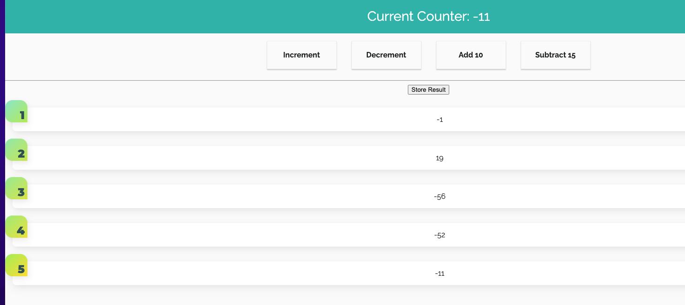

# react-counter
Simple typescript React application creating counter with incrementing, 
decrementing, adding and subtracting. You can store and delete the result, 
as well to display the current result.

## In the project directory, you can run:

### `npm install`
### `npm start`

## Add Redux for state management

### `npm install --save redux`

#### redux-basics.js

## Add Redux react -- hook or redux store with our React app

### `npm install --save raact-redux`

**I created redux-basics.js so we can see how store, reducer etc is created without React.
We can execute this file only with command: node redux-basics.js**

## App Preview

